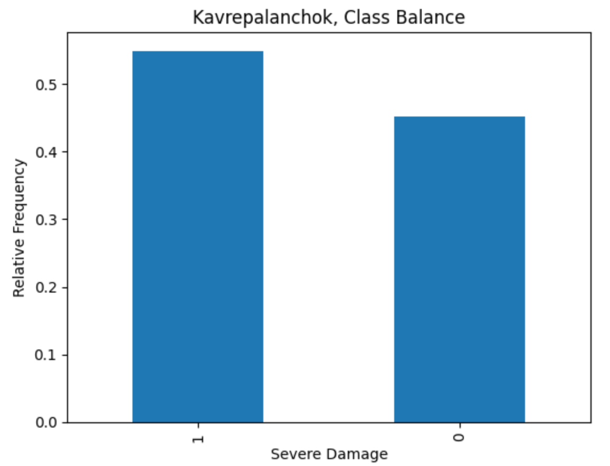
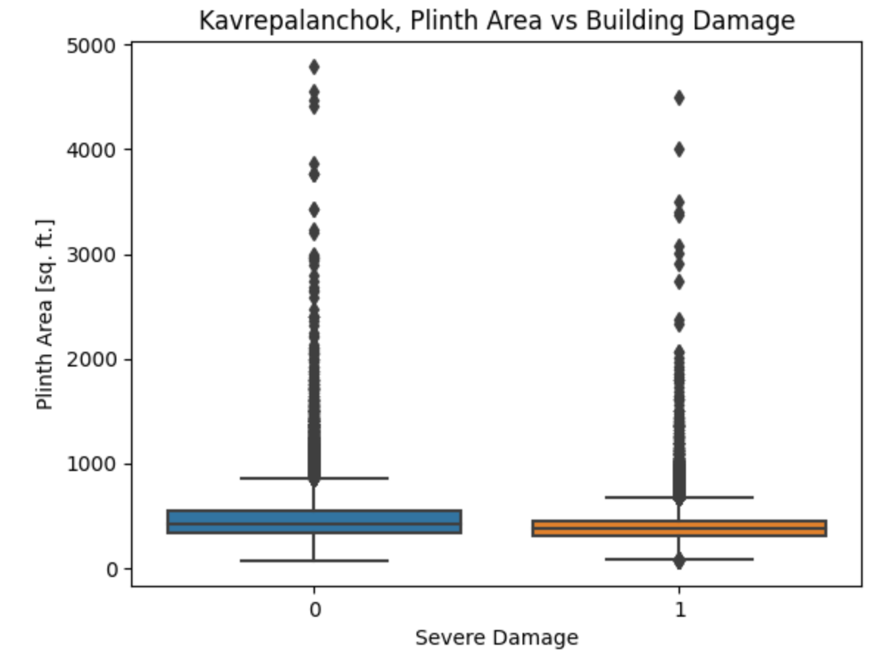
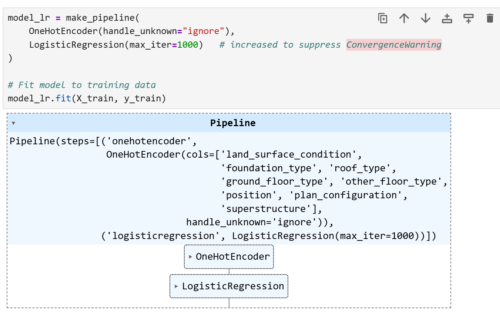
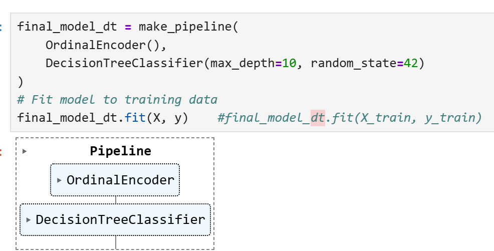
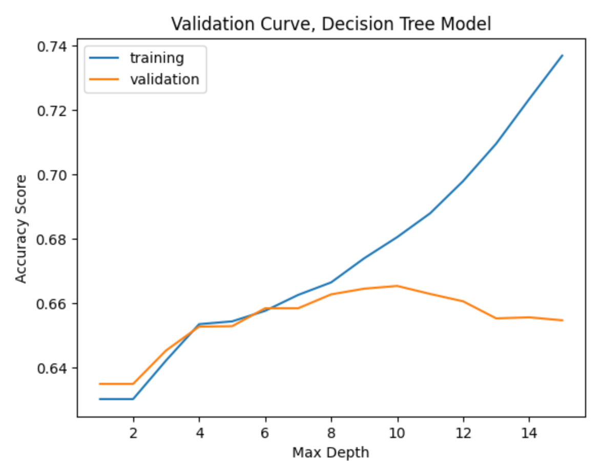

# Side Project: Earthquake damage prediction

Could we predict the consequence of disaster? Let's have a look at this practical project on predicting earthquake damage in Nepal!

## Goal:
To predict whether a building will suffer significant damage (a categorical outcome), so we need a classification model.

## Method:
Using classification model with Logistic Regression, Decision Trees to uncover complex relationships and decision rules within data.

## Data Exploration:
- To see that the classes are balanced in the dataset, let have a look at this bar chat with the normalized value counts from "severe_damage" column

- We wonder whether existing a relationship between the footprint size of a building and the damage it sustained in the earthquake, so creating a boxplot that shows a distributions of the "plinth_area_sq_ft" column for both groups in the "severe_damage" column:

## Modelling:
### 1 - Logistic Regression:

### 2- Decision Trees:

